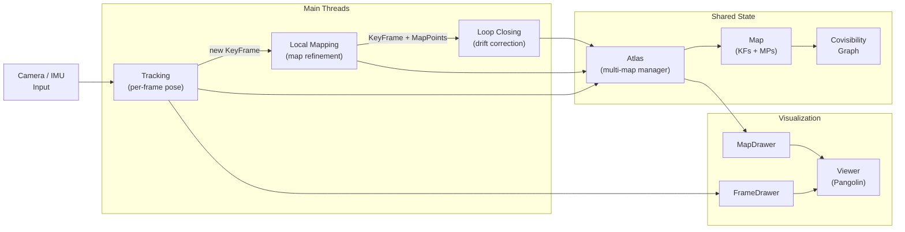

# ORB-SLAM3 Architecture

## Overview

A C++20 modernized fork of ORB-SLAM3 — a visual-inertial SLAM system supporting monocular, stereo, and RGB-D cameras with optional IMU fusion. All code lives in the `ORB_SLAM3` namespace. The system builds as a single shared library (`ORB_SLAM3`) with one unified binary (`orb_slam3_offline`) replacing all legacy per-dataset executables.

**Sensor modes**: `MONOCULAR`, `STEREO`, `RGBD`, `IMU_MONOCULAR`, `IMU_STEREO`, `IMU_RGBD`

## Threading Architecture

- **Tracking** — Runs on the main thread. Extracts ORB features per frame, matches against the local map, and estimates camera pose via motion model or relocalization. Decides when to insert new keyframes. States: `SYSTEM_NOT_READY`, `NO_IMAGES_YET`, `NOT_INITIALIZED`, `OK`, `RECENTLY_LOST`, `LOST`, `OK_KLT`.
- **Local Mapping** — Receives new keyframes from Tracking. Triangulates new map points, runs local bundle adjustment (g2o), and culls redundant keyframes.
- **Loop Closing** — Detects loop closures via DBoW2 place recognition. Corrects accumulated drift with pose-graph optimization and performs map merging for multi-map scenarios.

## Core Data Structures

| Class | Role |
|---|---|
| **System** | Entry point. Accepts vocabulary, settings, sensor type. Exposes `TrackStereo()`, `TrackRGBD()`, `TrackMonocular()` — all return `Sophus::SE3f`. |
| **Atlas** | Multi-map manager. Stores multiple `Map` instances, handles active map switching. |
| **Map** | Thread-safe container of keyframes and map points. Boost-serializable. |
| **KeyFrame** | Keyframe with ORB features, pose, covisibility graph, and spanning tree. |
| **MapPoint** | 3D landmark observed by multiple keyframes. Tracks descriptor, normal, observation count. |
| **Frame** | Single camera frame with extracted ORB features, undistorted keypoints, BoW vector. |

## Feature Extraction and Matching

- **ORBextractor** — Multi-scale ORB: FAST corner detection + oriented BRIEF descriptors across an image pyramid.
- **ORBmatcher** — Feature matching for tracking, triangulation, loop closing, and relocalization.

## Camera Models

- **GeometricCamera** — Abstract base with `project()` / `unproject()` interface.
- **Pinhole** — Standard pinhole model.
- **KannalaBrandt8** — Fisheye (equidistant) model, 8 parameters.

## IMU Integration

- **ImuTypes** — `Point` (accel + gyro sample), `Bias`, `Preintegrated`, `Calib` classes for inertial sensor fusion.

## Optimization

- **Optimizer** — Static methods: `PoseOptimization`, `LocalBundleAdjustment`, `GlobalBundleAdjustment`, `FullInertialBA`, `OptimizeEssentialGraph`.
- **G2oTypes** — Custom g2o vertex and edge types for visual-inertial optimization.

## Dataset Runners (Strategy Pattern)

- **DatasetRunner** — Abstract base for offline dataset processing.
- **EuRoCRunner**, **TumRunner**, **TumViRunner** — Concrete implementations.
- Factory function `createDatasetRunner(config)` dispatches by `DatasetType` enum.

## Serialization

- Boost.Serialization for `Atlas` / `Map` / `KeyFrame` / `MapPoint` persistence (save and load maps).

## Dependencies

| Library | Version | Purpose |
|---|---|---|
| OpenCV | 4.4+ | Image processing, feature detection |
| Eigen3 | 3.x | Linear algebra |
| Pangolin | — | 3D visualization |
| Boost | — | Serialization, program_options |
| spdlog | — | Logging |
| DBoW2 | in-tree | Bag-of-words place recognition |
| g2o | in-tree | Graph-based optimization |
| Sophus | in-tree | Lie group SE3/SO3 representations |
| OpenSSL | — | Cryptographic hashing |
| GoogleTest | — | Unit testing |
