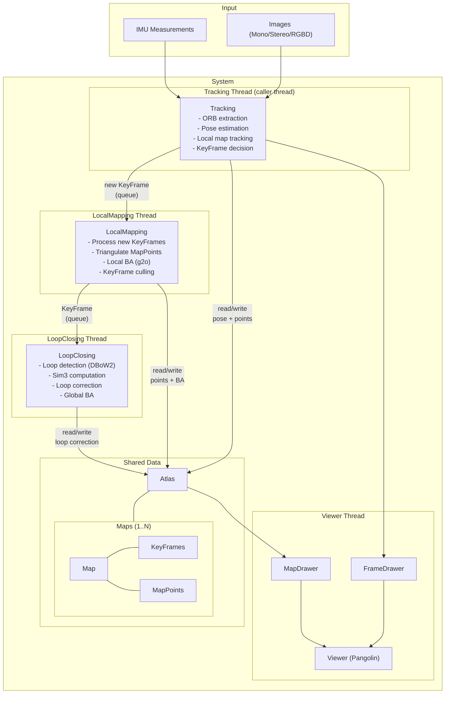
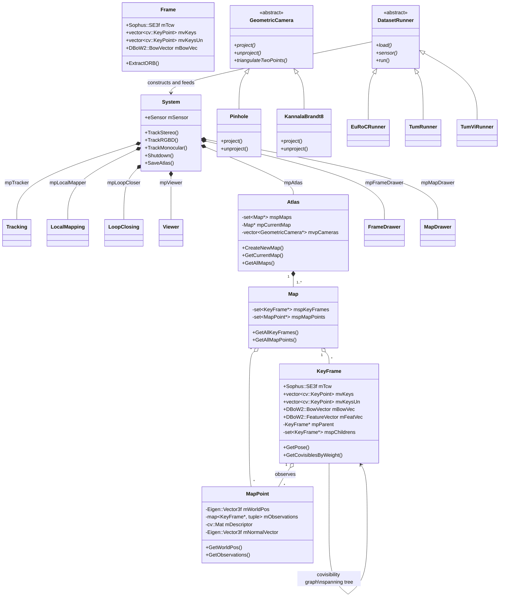
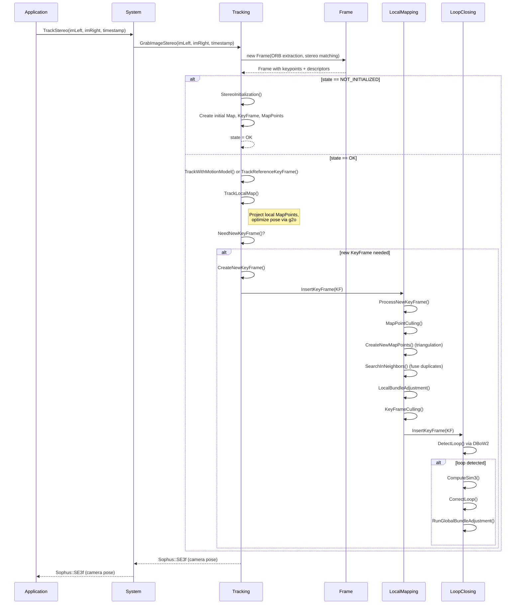
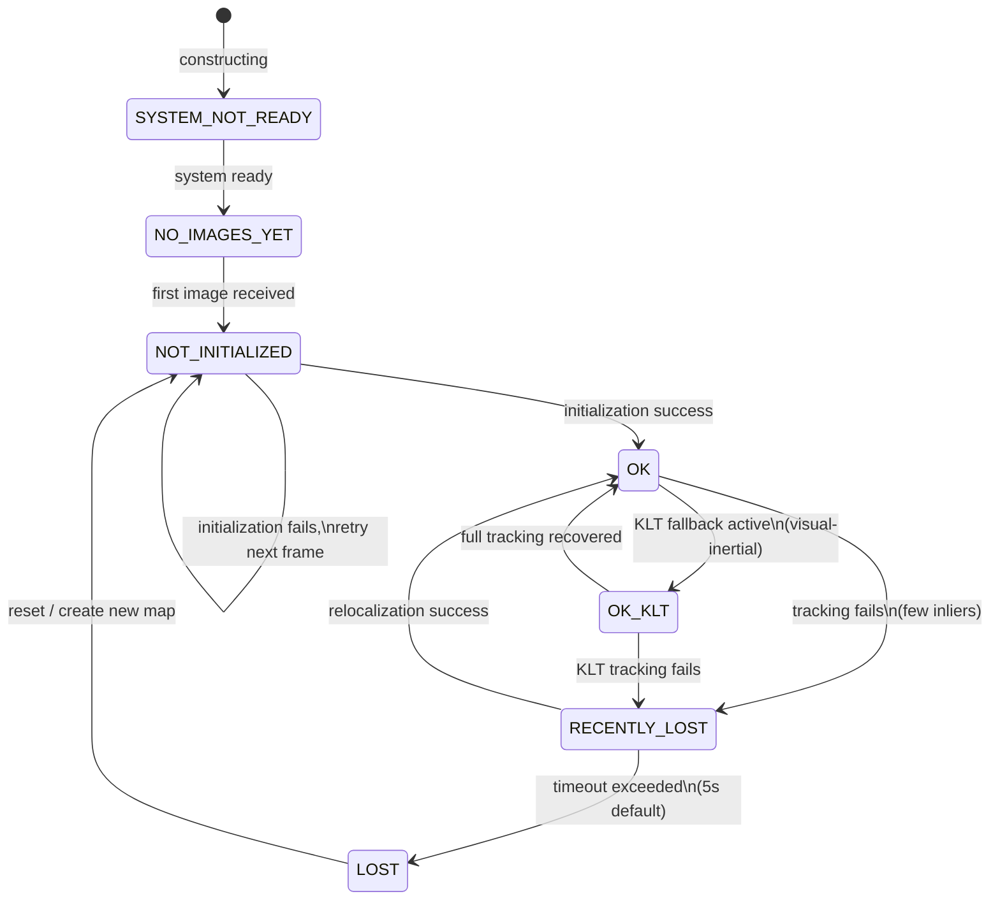

# ORB-SLAM3 System Diagrams

## 1. Component Diagram -- Threading Architecture

The system runs four concurrent threads sharing data through the Atlas multi-map container. Tracking runs on the caller thread; the other three are spawned at startup.

## 2. Class Diagram -- Core Data Model

Core ownership and inheritance relationships. System owns all major components; Atlas manages multiple Maps, each containing sets of KeyFrames and MapPoints.

## 3. Sequence Diagram -- Frame Processing Pipeline

End-to-end flow when a new stereo frame arrives, from image input through local mapping and loop closing.

## 4. State Diagram -- Tracking States

Tracking thread state machine defined in `Tracking::eTrackingState`. Values: SYSTEM_NOT_READY (-1), NO_IMAGES_YET (0), NOT_INITIALIZED (1), OK (2), RECENTLY_LOST (3), LOST (4), OK_KLT (5).

